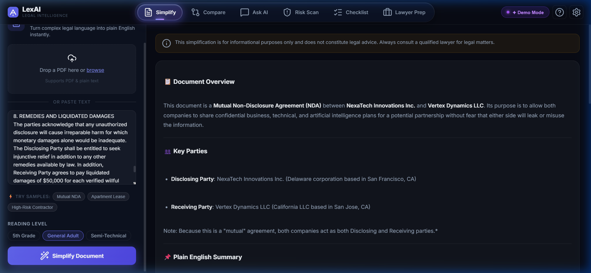

# LexAI — GenAI-Powered Legal Assistant

> Making legal information accessible to everyone, powered by Google Gemini.



## 🚀 Features

| Feature | Description |
|---|---|
| 📄 **Document Simplifier** | Convert complex legal jargon into plain English at any reading level |
| 🔍 **Contract Comparator** | Compare two documents side-by-side with visual diff + risk scoring |
| 💬 **Legal Q&A Chat** | Chat with AI about your uploaded document |
| ⚠️ **Risk Scanner** | Identify and categorize risky clauses (Low/Medium/High) |
| ✅ **Action Checklist** | Generate prioritized next steps for your legal situation |
| 🎤 **Lawyer Prep** | Get AI-curated questions to ask your lawyer |

## ⚡ Quick Start

### Prerequisites
- A modern web browser (Chrome/Edge/Firefox with ES Module support)
- A free [Google Gemini API key](https://aistudio.google.com/apikey)

### Run Locally

**Option 1 — Python (built-in, no install needed):**
```bash
# Python 3
python -m http.server 8080

# Then open: http://localhost:8080
```

**Option 2 — Node.js:**
```bash
npx serve .
# or
npx http-server . -p 8080
```

**Option 3 — VS Code:**
Install the **Live Server** extension, then right-click `index.html` → "Open with Live Server"

### First Time Setup
1. Open the app in your browser
2. Click the **⚙️ Settings** button in the top-right
3. Enter your Gemini API key (get one free at [Google AI Studio](https://aistudio.google.com/apikey))
4. Select your preferred model (Gemini 2.0 Flash recommended)
5. Click **Save Settings**

## 🏗️ Architecture

```
index.html          ← Single-page app shell
css/
  style.css         ← Dark glassmorphism design system
js/
  app.js            ← Core app: tabs, settings, routing
  gemini.js         ← Google Generative AI SDK client
  document.js       ← PDF.js text extraction + file upload
  ui.js             ← Shared UI: toasts, skeletons, markdown
  simplify.js       ← Document Simplifier feature
  compare.js        ← Contract Comparator feature
  qa.js             ← Legal Q&A Chat feature
  clauses.js        ← Clause Risk Analyzer feature
  checklist.js      ← Action Checklist Generator
  prepare.js        ← Lawyer Prep Assistant
```

## 🛠️ Tech Stack

- **Frontend**: Vanilla HTML5, CSS3, ES Modules (no build step!)
- **AI**: Google Gemini 2.0 Flash via `@google/generative-ai` JS SDK
- **PDF Parsing**: PDF.js 3.x
- **Icons**: Lucide Icons
- **Fonts**: Inter (Google Fonts)

## 🔒 Privacy & Security

- Your Gemini API key is stored only in your browser's `localStorage`
- No data is sent to any server other than Google's Gemini API
- No backend, no tracking, no cookies

## ⚠️ Disclaimer

LexAI provides legal information and AI-assisted analysis for educational purposes only. It does not constitute legal advice and should not replace consultation with a qualified legal professional. Always consult a licensed attorney for matters that may affect your legal rights.

## 📄 License

MIT License — see [LICENSE](./LICENSE)
